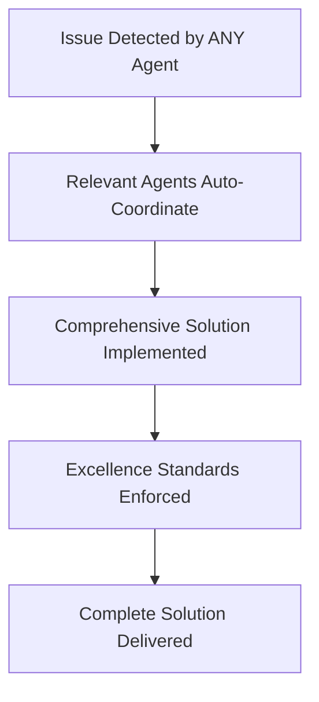
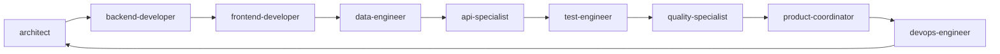
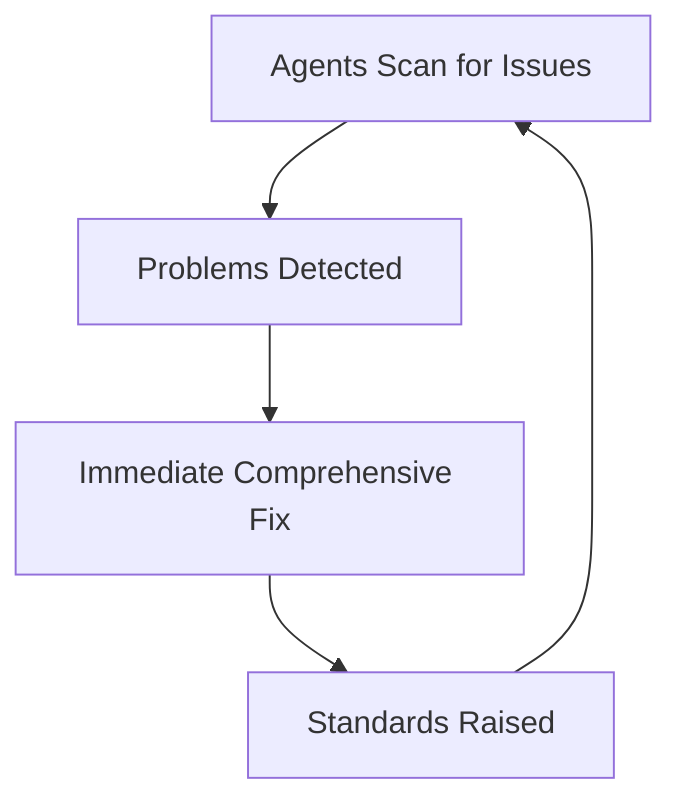

# Prometheus Agents 🚀

**Version: 1.5 - Revolutionary Two-Layer Intelligence + Phoenix 1.8 & DaisyUI Integration**

The most AGGRESSIVE and PROACTIVE AI agent system ever created for software development. After a revolutionary consolidation from 23 agents to 9 elite agents (61% reduction), each agent now automatically detects problems and implements comprehensive solutions WITHOUT asking permission.

**NEW IN v1.1.0**: Full MCP (Model Context Protocol) integration! All agents now leverage Serena for semantic code intelligence, Tidewave for Elixir testing, and specialized MCPs for their domains.

**NEW IN v1.1.1**: DRY (Don't Repeat Yourself) principle enforcement! All agents now follow strict DRY principles during code execution, with shared patterns library and systematic reuse of existing code.

**NEW IN v1.2.0**: Advanced Reasoning Integration! Sequential Thinking and now systematically activated with automated trigger patterns, orchestrated workflows, and multi-model consensus validation for complex decisions.

**NEW IN v1.3.0**: Template Flexibility Enhancement! All agents now support both Surface (.sface) and HEEx (.heex) templating approaches, with enhanced specialization knowledge integrated from domain experts while maintaining consistent tool and model selection.

**NEW IN v1.3.1**: Memory Integration Enhancement! Removed standalone Memory MCP and integrated memory functionality directly into Serena MCP using write_memory/read_memory tools for better project knowledge persistence.

**NEW IN v1.3.2**: Global Instructions Integration! Added universal Claude Code instructions in `/global/CLAUDE.md` covering task delegation, git workflows, and code analysis tools. These global instructions now complement project-specific agent behaviors for unified excellence.

**🚀 REVOLUTIONARY IN v1.4.0**: Two-Layer Intelligence Architecture! All agents now operate with unprecedented code intelligence through systematic orchestration of Serena (semantic code understanding), Zen (16 sophisticated AI analysis tools), and Sequential Thinking (complex reasoning). Features sophisticated intelligence cascades, multi-model consensus validation with 28+ AI models, assumption challenge workflows, and adaptive model selection for different problem types. This creates a comprehensive intelligence system with zero blind spots in code analysis.

**🚀 ENHANCED IN v1.5**: Phoenix 1.8 + DaisyUI Integration! Added comprehensive Phoenix 1.8 capabilities (LiveView Streams, modern navigation, verified routes, enhanced Presence) and complete DaisyUI component system expertise (30+ semantic components, theme management, accessibility features). All agents now have full expertise in modern Phoenix development with sophisticated UI component integration patterns.

## 🔥 Revolutionary Breakthrough

**ZERO TOLERANCE POLICY**: Every agent operates with aggressive excellence standards:
- **PROACTIVE** - Automatically detects issues across all domains  
- **AGGRESSIVE** - Implements comprehensive solutions immediately
- **ZERO PERMISSION** - Fixes problems without asking first
- **COMPREHENSIVE** - Goes beyond requirements to deliver excellence
- **AUTOMATIC** - Continuous scanning and improvement
- **🚀 TWO-LAYER INTELLIGENCE** - Serena + Sequential Thinking orchestration
- **🚀 COMPLEXITY AWARENESS** - Automatic activation for complex problems
- **🚀 DRY ENFORCEMENT** - Systematic pattern search and reuse

## 🎯 Key Features

- **9 Elite PROACTIVE Agents** - Consolidated from 23 agents for maximum effectiveness
- **ZERO PERMISSION REQUIRED** - Agents fix problems immediately upon detection  
- **AGGRESSIVE Excellence** - Zero tolerance for suboptimal code or technical debt
- **Comprehensive Solutions** - Every fix exceeds requirements and implements best practices
- **Multi-Domain Expertise** - Each agent consolidates multiple specializations
- **Automatic Intervention** - Continuous scanning and proactive improvements
- **Framework Mastery** - Elixir/Phoenix (Ash Framework), Flutter, React Native, SvelteKit
- **MCP Integration** - Leverages Serena, Tidewave, Figma, Browser, Notion, and more MCPs
- **Semantic Code Intelligence** - Understands code structure, not just text patterns
- **Multi-Model Consensus** - Uses AI consensus for critical decisions
- **DRY Principle Enforcement** (v1.1.1) - Systematic code reuse and pattern extraction
- **Shared Patterns Library** (v1.1.1) - Centralized repository of reusable components
- **Sequential Thinking Activation** (v1.2.0) - Automatic systematic problem decomposition
- **Orchestrated MCP Workflows** (v1.2.0) - Cascading analysis and validation patterns
- **Automated Trigger Patterns** (v1.2.0) - Complexity-based activation thresholds
- **🚀 Two-Layer Intelligence** (v1.5) - Streamlined Serena + Sequential Thinking architecture
- **🚀 Complexity-Based Activation** (v1.5) - Automatic Sequential Thinking for complex problems
- **🚀 DRY Enforcement** (v1.5) - Systematic pattern search and reuse before generating code
- **🚀 Semantic-First Analysis** (v1.5) - Always understand code context before modifications
- **🚀 Phoenix 1.8 Mastery** (v1.5) - LiveView Streams, modern navigation, verified routes, enhanced Presence
- **🚀 DaisyUI Component System** (v1.5) - Complete expertise in 30+ semantic components, theme management

## 🤖 The Elite 9: PROACTIVE and AGGRESSIVE Agents

### 🏗️ **architect** - Strategic Vision & System Design  
**Consolidates**: brainstormer + solutions-architect + specifications-writer
- **AGGRESSIVELY** challenges architectural decisions and forces optimal solutions
- **AUTOMATICALLY** creates PRDs, technical specs, and comprehensive documentation
- Combines creative ideation with rigorous system design and strategic planning

### ⚡ **backend-developer** - Elixir/Phoenix Mastery
**Enhanced** elixir-developer with zero-tolerance policies + Phoenix 1.8 expertise
- **ZERO TOLERANCE** for non-Ash patterns - automatically converts Ecto to Ash
- **PROACTIVELY** optimizes performance, implements proper error handling  
- **AGGRESSIVELY** enforces OTP principles and LiveView best practices
- **NEW**: Complete Phoenix 1.8 mastery (LiveView Streams, verified routes, modern navigation)

### 🎨 **frontend-developer** - Universal UI/UX Excellence
**Consolidates**: ux-designer + web-developer + sveltekit-developer + flutter-developer + reactnative-developer + DaisyUI expertise
- **IMMEDIATELY** fixes UI/UX inconsistencies and accessibility issues
- **AGGRESSIVELY** enforces design systems across ALL platforms
- **AUTOMATICALLY** optimizes performance and user experience
- **NEW**: Complete DaisyUI mastery (30+ components, theme system, responsive design)

### 📊 **data-engineer** - Data Architecture & Semantic Excellence  
**Consolidates**: database-specialist + data-architect + ontology-specialist
- **ZERO TOLERANCE** for inefficient queries - automatically optimizes and indexes
- **PROACTIVELY** designs optimal schemas and implements proper migrations
- **AGGRESSIVELY** enforces data integrity and implements RDF/SPARQL when needed

### 🔌 **api-specialist** - API Design & Implementation Mastery
**Consolidates**: api-designer + api-implementer + api-documenter + technical-writer  
- **IMMEDIATELY** fixes API inconsistencies and implements OpenAPI specifications
- **PROACTIVELY** enforces REST principles, authentication, and rate limiting
- **AUTOMATICALLY** generates complete API documentation and integration guides

### 🧪 **test-engineer** - Comprehensive Testing Excellence
**Consolidates**: test-architect + test-implementer + code-reviewer
- **ZERO TOLERANCE** for untested code - automatically generates comprehensive test suites
- **AGGRESSIVELY** enforces 100% code coverage and quality metrics
- **AUTOMATICALLY** sets up CI/CD testing pipelines and quality gates

### 🛡️ **quality-specialist** - Security & Performance Guardian
**Consolidates**: security-specialist + performance-optimizer
- **IMMEDIATELY** fixes security vulnerabilities and performance bottlenecks  
- **PROACTIVELY** implements OWASP best practices and proper authentication
- **AUTOMATICALLY** conducts security audits and performance profiling

### 📋 **product-coordinator** - Project & Product Excellence
**Enhanced** project-coordinator with comprehensive product management
- **PROACTIVELY** identifies project risks and implements mitigation strategies
- **AGGRESSIVELY** enforces Agile best practices and proper sprint planning
- **AUTOMATICALLY** creates comprehensive project documentation and tracking

### 🚀 **devops-engineer** - Infrastructure & Deployment Mastery  
**Enhanced** with proactive behaviors and zero-tolerance automation
- **ZERO TOLERANCE** for manual deployments - automatically implements full CI/CD
- **AGGRESSIVELY** enforces Infrastructure as Code and proper security practices
- **AUTOMATICALLY** implements backup strategies, disaster recovery, and scaling

## ⚡ Lightning Fast Setup

### Installation - Elite 9 Agents

Deploy the PROACTIVE agent system to your environment:

#### Option 1: Project-Level Installation (Recommended)
```bash
# Deploy elite 9 agents to your project
mkdir -p .claude/agents/shared
cp agents/*.md .claude/agents/
cp agents/shared/*.md .claude/agents/shared/

# The 9 agents with DRY principles are now ACTIVE and scanning for issues
```

#### Option 2: User-Level Installation (Global access)
```bash
# Deploy globally for all projects  
mkdir -p ~/.claude/agents/shared
cp agents/*.md ~/.claude/agents/
cp agents/shared/*.md ~/.claude/agents/shared/
```

### 🔥 PROACTIVE Agent Usage

Each agent **automatically detects and fixes problems** - no permission required:

```bash
@architect      # Strategic design + comprehensive planning
@backend-developer   # Elixir/Phoenix excellence with zero tolerance
@frontend-developer  # Universal UI/UX across all platforms  
@data-engineer       # Data architecture + semantic web mastery
@api-specialist      # Complete API solutions with documentation
@test-engineer       # Comprehensive testing with 100% coverage
@quality-specialist  # Security + performance guardian
@product-coordinator # Project + product management excellence
@devops-engineer     # Infrastructure automation mastery
```

### 🚀 Revolutionary Workflows

#### **Instant Feature Development** (All agents coordinate automatically)
```bash
@architect           # Designs optimal architecture + creates specs
  ↓ (AUTOMATIC)
@backend-developer   # Implements with Elixir/Phoenix best practices
  ↓ (AUTOMATIC)  
@frontend-developer  # Creates exceptional UI across platforms
  ↓ (AUTOMATIC)
@api-specialist      # Delivers complete API + documentation
  ↓ (AUTOMATIC)
@test-engineer       # Implements exhaustive testing
  ↓ (AUTOMATIC)
@quality-specialist  # Enforces security + performance
  ↓ (AUTOMATIC)
@devops-engineer     # Automates deployment + infrastructure
```

#### **Zero-Tolerance Code Excellence** (Automatic intervention)
```bash
# Agent detects ANY issue and IMMEDIATELY:
1. Fixes the problem without asking
2. Implements comprehensive solution  
3. Exceeds requirements with best practices
4. Documents everything thoroughly
5. Adds proper testing and validation
```

## 📁 Project Structure

```
prometheus-agents/
├── agents/                    # Elite 9 PROACTIVE Agents (v1.5 Enhanced)
│   ├── architect.md           # Strategic vision + Serena/integration
│   ├── backend-developer.md   # Elixir/Phoenix 1.8 + Tidewave MCP support
│   ├── frontend-developer.md  # Universal UI/UX + DaisyUI + Figma/Browser MCP
│   ├── data-engineer.md       # Data architecture + semantic MCPs
│   ├── api-specialist.md      # API design + Notion documentation MCP
│   ├── test-engineer.md       # Comprehensive testing + Tidewave MCP
│   ├── quality-specialist.md  # Security & performance + audit MCPs
│   ├── product-coordinator.md # Project management + Notion MCP
│   └── devops-engineer.md     # Infrastructure + monitoring MCPs
├── rules/                     # Enhanced framework rules
│   ├── ash.md                 # Ash Framework with zero-tolerance
│   ├── ash_phoenix.md         # Phoenix + Ash integration
│   ├── mcp.md                 # MCP integration guidelines
│   ├── usage_rules_elixir.md  # Elixir/OTP aggressive enforcement
│   └── usage_rules_otp.md     # OTP proactive behaviors
├── super-agents/              # Advanced multi-agent coordination
├── CLAUDE.md                  # Project configuration (v1.5)
├── CHANGELOG.md               # Version history with v1.5 Phoenix 1.8 + DaisyUI update
└── README.md                  # This revolutionary documentation
```

## 🔧 Technology Stack

### Backend
- **Elixir/Phoenix** with **Ash Framework** (not Ecto)
- **PostgreSQL** with AshPostgres
- **REST APIs** with AshJsonApi

### Frontend
- **Phoenix LiveView** with **Phoenix 1.8** (Streams, verified routes, modern navigation) + **DaisyUI** components
- **SvelteKit** for full-stack JavaScript
- **Flutter** with GetX state management
- **React Native** with Expo

### Testing
- **ExUnit** for Elixir
- **Jest/Vitest** for JavaScript
- **Flutter Test Framework**
- **React Native Testing Library**

### Quality Tools
- **Credo** for Elixir
- **ESLint** for JavaScript/TypeScript
- **Dart Analyzer** for Flutter

## 🔌 MCP (Model Context Protocol) Integration

### Core MCPs Used by All Agents
- **Serena MCP** - Semantic code intelligence, refactoring, and project memory (write_memory/read_memory tools)
- **Sequential Thinking MCP** - Complex problem decomposition and systematic reasoning
- **Context7 MCP** - Up-to-date library documentation
- **Brave Search MCP** - Real-time web search for best practices

### Specialized MCPs by Domain
- **Backend**: Tidewave MCP for Elixir test generation
- **Frontend**: Figma MCP for design sync, Browser MCP for testing
- **Documentation**: Notion MCP for comprehensive docs
- **Testing**: Browser MCP for E2E testing
- **Analysis**: Sequential Thinking MCP for complex problems

## 📚 Documentation

- **[CLAUDE.md](CLAUDE.md)** - v1.5 configuration with Two-Layer Intelligence + Phoenix 1.8 + DaisyUI
- **[CHANGELOG.md](CHANGELOG.md)** - Version history featuring v1.5 Phoenix 1.8 + DaisyUI integration

## 🤖 Elite Agent Coordination

### **Rapid Response Pattern** (Automatic)


### **Excellence Enforcement Chain** (Automatic)


### **Continuous Improvement Loop** (Always Active)


## 🎯 Agent Specialization Matrix

| Agent | Architecture | Backend | Frontend | Data | API | Testing | Security | Performance | DevOps |
|-------|-------------|---------|----------|------|-----|---------|----------|-------------|---------|
| **architect** | ★★★ | ★★★ | ★★ | ★★ | ★★ | ★ | ★ | ★ | ★ |
| **backend-developer** | ★★ | ★★★ | ★ | ★★ | ★★★ | ★★ | ★ | ★★ | ★ |
| **frontend-developer** | ★ | ★ | ★★★ | ★ | ★ | ★★ | ★ | ★★ | ★ |
| **data-engineer** | ★★ | ★★ | ★ | ★★★ | ★★ | ★★ | ★ | ★★★ | ★ |
| **api-specialist** | ★★ | ★★ | ★ | ★★ | ★★★ | ★★ | ★★ | ★ | ★ |
| **test-engineer** | ★ | ★★ | ★★ | ★★ | ★★ | ★★★ | ★★ | ★ | ★ |
| **quality-specialist** | ★ | ★★ | ★ | ★ | ★★ | ★★ | ★★★ | ★★★ | ★★ |
| **product-coordinator** | ★★ | ★ | ★ | ★ | ★ | ★ | ★ | ★ | ★★★ |
| **devops-engineer** | ★★ | ★ | ★ | ★ | ★ | ★★ | ★★★ | ★★ | ★★★ |

## 👤 User Context

This project is designed for:
- Software Solutions Architects
- Elixir Phoenix Engineers
- Data Architects specializing in:
  - Data schema design
  - Enterprise data flows
  - Semantic data (RDF, SPARQL, OWL)
- Full-stack developers working across multiple platforms

## ⚡ Getting Started - PROACTIVE Mode

1. **Deploy agents** - Install the elite 9 and activate PROACTIVE mode
2. **Zero configuration** - Agents automatically detect your tech stack
3. **Immediate intervention** - Problems fixed without permission
4. **Excellence by default** - Every solution exceeds requirements

## 📖 Enhanced Usage Rules

PROACTIVE agents follow enhanced rules with zero-tolerance enforcement:
- **Elixir/OTP** - Aggressive best practice enforcement, automatic Ecto→Ash conversion
- **Ash Framework** - Zero tolerance for non-Ash patterns, comprehensive resource design
- **Memory/MCP** - Proactive optimization and intelligent context management
- **Quality Standards** - 100% test coverage, security-first development, performance optimization

See the [rules/](rules/) directory for PROACTIVE behavior guidelines.

## 🚀 Revolutionary Principles

- **PROACTIVE** - Agents detect and fix issues automatically
- **AGGRESSIVE** - Zero tolerance for suboptimal code or practices
- **COMPREHENSIVE** - Every solution exceeds requirements and includes documentation
- **AUTOMATIC** - Continuous scanning, intervention, and improvement
- **EXCELLENCE** - Industry-leading standards enforced by default

## 📝 License

This project is licensed under the MIT License - see below:

```
MIT License

Copyright (c) 2025 Terry Lee

Permission is hereby granted, free of charge, to any person obtaining a copy
of this software and associated documentation files (the "Software"), to deal
in the Software without restriction, including without limitation the rights
to use, copy, modify, merge, publish, distribute, sublicense, and/or sell
copies of the Software, and to permit persons to whom the Software is
furnished to do so, subject to the following conditions:

The above copyright notice and this permission notice shall be included in all
copies or substantial portions of the Software.

THE SOFTWARE IS PROVIDED "AS IS", WITHOUT WARRANTY OF ANY KIND, EXPRESS OR
IMPLIED, INCLUDING BUT NOT LIMITED TO THE WARRANTIES OF MERCHANTABILITY,
FITNESS FOR A PARTICULAR PURPOSE AND NONINFRINGEMENT. IN NO EVENT SHALL THE
AUTHORS OR COPYRIGHT HOLDERS BE LIABLE FOR ANY CLAIM, DAMAGES OR OTHER
LIABILITY, WHETHER IN AN ACTION OF CONTRACT, TORT OR OTHERWISE, ARISING FROM,
OUT OF OR IN CONNECTION WITH THE SOFTWARE OR THE USE OR OTHER DEALINGS IN THE
SOFTWARE.
```

## 🌟 Community

Built with 🔥 for the **Claude** and **Elixir** communities. Version 1.0.0 represents a revolutionary breakthrough in PROACTIVE AI agents that automatically deliver software excellence without compromise.

**The future is AGGRESSIVE excellence. The future is PROACTIVE AI. The future is NOW.**

## 👨‍💻 Author

**Terry Lee**
- LinkedIn: [https://www.linkedin.com/in/terryleesingapore/](https://www.linkedin.com/in/terryleesingapore/)
- GitHub: [https://github.com/mudspot](https://github.com/mudspot)

---

_Revolutionizing software development with PROACTIVE and AGGRESSIVE AI agents that deliver uncompromising excellence. No permission required. No compromises accepted. Only perfection delivered._
